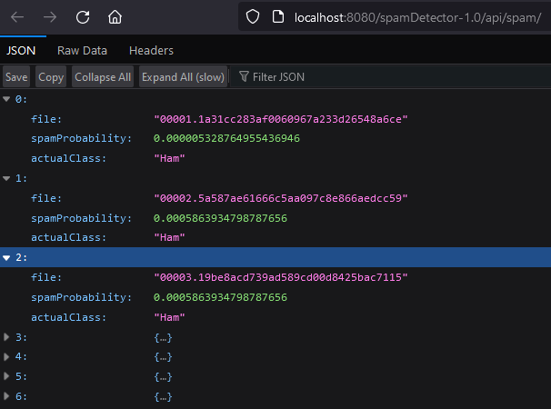
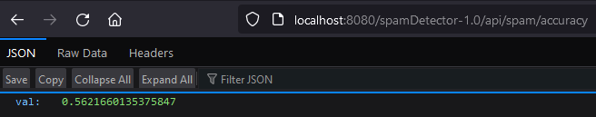
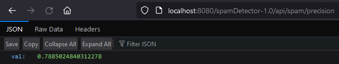
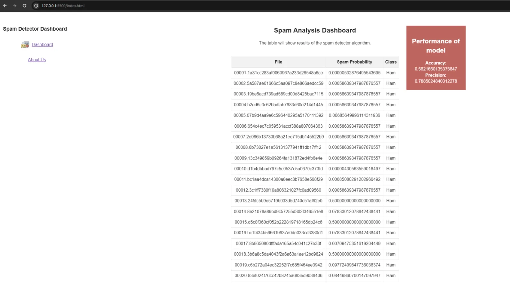
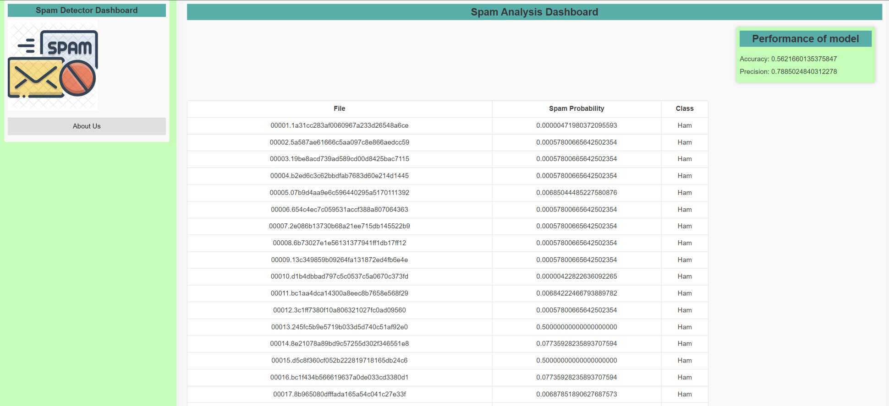
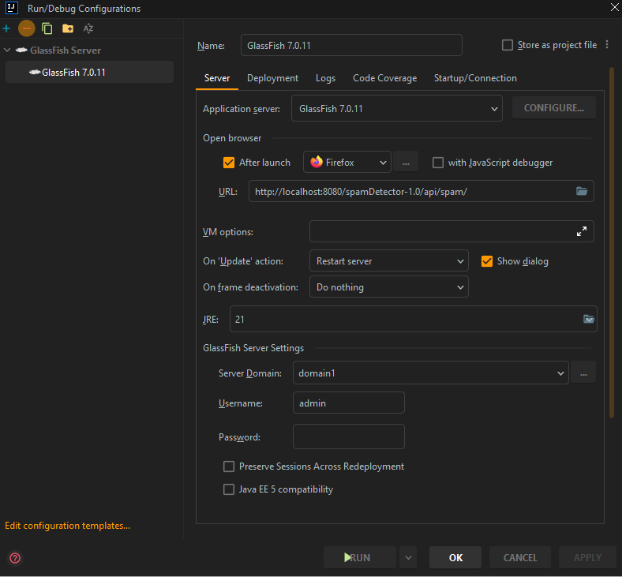
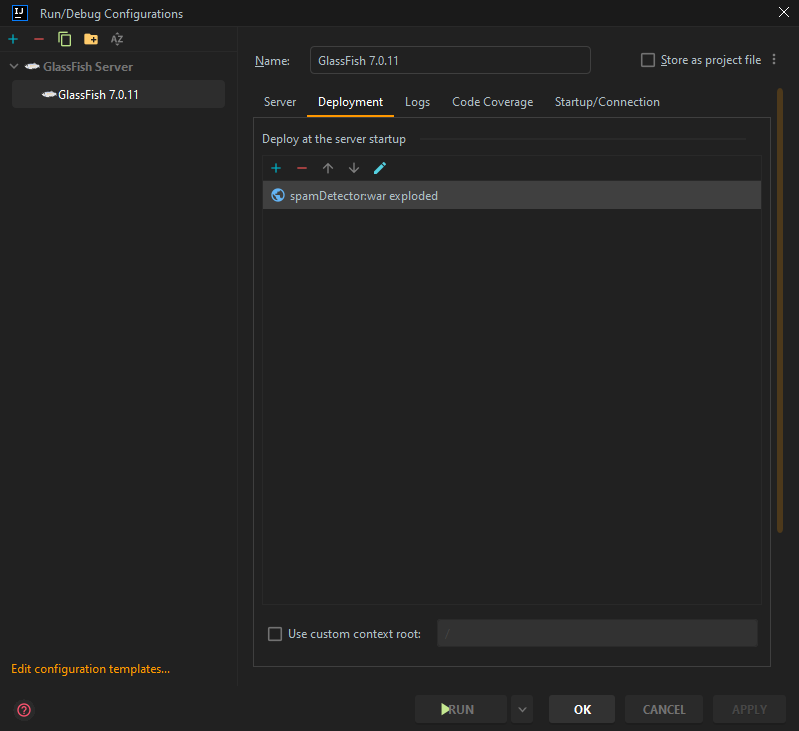
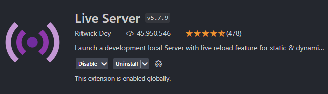
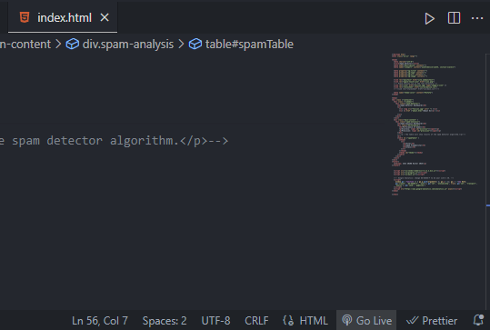

# CSCI2020U Assignment 1

Follow this guide to help  navigating how to use our Spam Detector Application.

## a. Project Information

### Description

Our project is a Spam Detector application designed to filter out spam emails from a user's inbox. The application
utilizes a unigram approach to analyze the frequency of words in emails and associate them with whether the message is spam or not. The system is trained using a dataset of emails, and it calculates probabilities based on each word's
frequency to classify new emails as spam or legitimate.

### Group Members

Our group consists of four members.
- Eisha Rizvi
- Sadhna Drall
- Humaiyun Uddin
- Mridul Sharma

### Accuracy

The accuracy of our application is `0.5621660135375847` and the precision of the program is `0.7885024840312278`.

## b. Improvements
Removing words that only appear in either the ham or spam datasets could potentially streamline the model. This method
is akin to cutting out outliers in a dataset that may skew results towards false positives or negatives. For example,
if a word is unique to spam emails in the training set but appears in a legitimate email, it could unjustly classify it
as spam. By filtering out such words, we're essentially focusing on more common indicators of spam, which could lead to
a more balanced and accurate classification. 

Significant improvements have been made to the frontend of the application as well. These enhancements were implemented to increase user-friendliness and overall usability. By refining the frontend interface, we aimed to streamline user interactions and ensure a more intuitive display for users. This overhaul not only enhances the visual appeal but also focuses on increasing ease of navigation.

Previous Interface:

New Improved Interface:

## c. How to Run

Firstly, get the server running.

In order to run the server, the steps to follow are
1. Open `spamDetectorServer` folder in IntelliJ.
2. Run the GlassFish Server locally. Refer to the images below for the GlassFish configuration.
- 
- 
1. Confirm it's working by visiting `http://localhost:8080/spamDetector-1.0/api/spam/`, if you see a json array of TestFile objects then the server is working.

After you confirm the server is running, now you need to run the frontend:
- open the `SpamDetectorClient` folder using VSCode
- ensure you have the `Live Server` extension
- 
- open `index.html` by pressing the new "Go Live" button on the bottom right of the window
- 
- This should launch a new web page in your default browser
- Wait 5 - 10 seconds for it to fetch the data from the server

## d. Other Sources
No other sources were used in our project.
